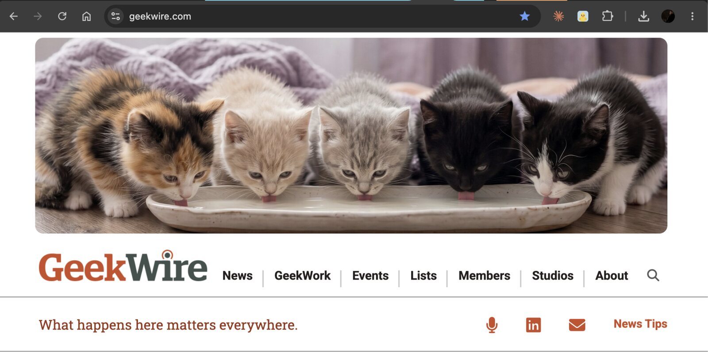
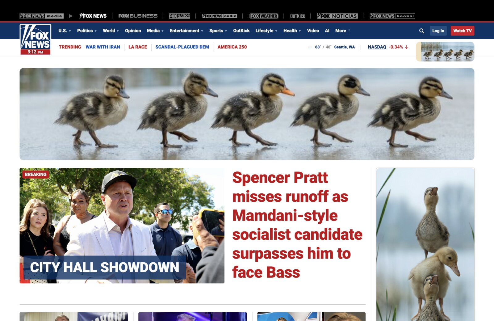
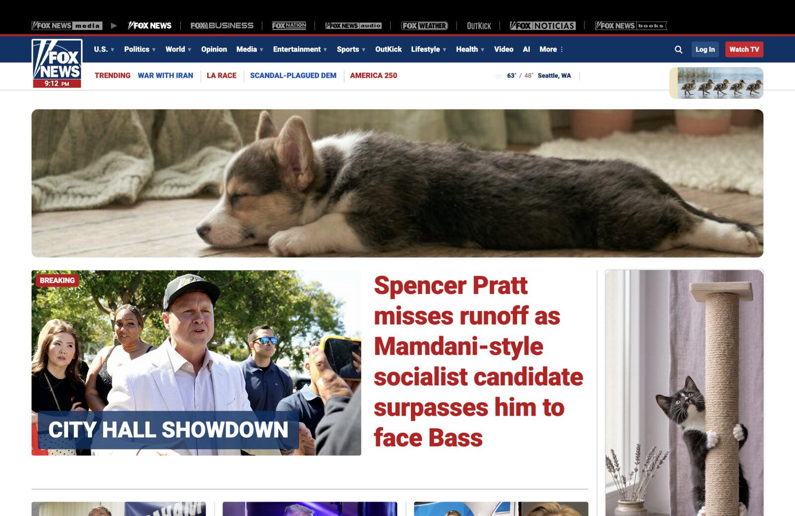
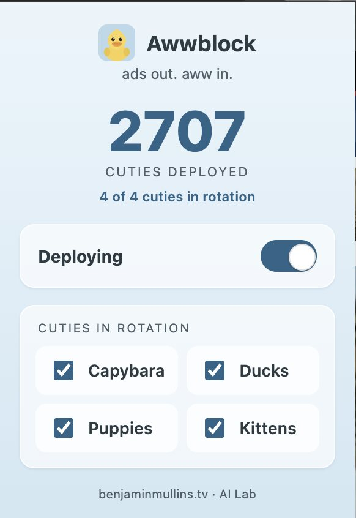
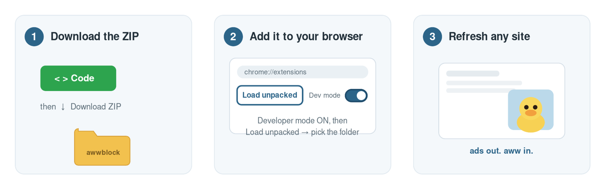

# Awwblock

**Ads out. Aww in.**

Awwblock is a browser extension that quietly replaces the ads on the web with calming animals: capybaras, ducks, puppies, and kittens. Where a banner used to be, you get a tiny, lovely moment of aww.

It won't fix the internet. But it might make your corner of it a little softer, one ad slot at a time.

> Note: Awwblock *replaces* ads, it doesn't block them. Run it **instead of** an ad blocker, not alongside one. (If uBlock/AdBlock removes an ad first, there's nothing left for Awwblock to turn into a duck.)

---

## See it in action

Real ad slots on real news sites, quietly turned calm. (The sites didn't agree to this; that's half the fun.)

*GeekWire's header leaderboard, optimized to five kittens and a saucer of milk.*

| | |
| --- | --- |
|  |  |

*Fox News: a big improvement! ducklings on parade up top (left); a sleeping corgi in the billboard and a kitten on the scratching post in the rail (right).*

*The popup: pick your animals and watch the "cuties deployed" counter climb.*

---

## How to install it (the easy way)

Awwblock isn't in the browser stores yet, so you install it "unpacked." That sounds technical but it's about 30 seconds, three steps, no command line.

**TL;DR (Chrome / Edge):** download the ZIP and unzip it, go to `chrome://extensions`, turn on **Developer mode**, click **Load unpacked**, and pick the folder. Done. Steps with detail below.

### Step 1: Get the files (everyone)

1. Grab the code: easiest is the **[latest release](../../releases/latest)** (download the ZIP asset). Or click the green **`< > Code`** button on this page and choose **Download ZIP**.
2. Find the downloaded `.zip` (usually in your **Downloads** folder) and **double-click it to unzip**.
3. You now have an **`awwblock`** folder (if you used the green Code button, it's named `awwblock-main`; either is fine). Remember where it is. Don't delete it; the extension runs from this folder.

### Step 2: Add it to your browser

**Chrome or Edge**

1. Open a new tab and go to `chrome://extensions` (Edge: `edge://extensions`).
2. Turn on **Developer mode** (toggle in the top-right corner).
3. Click **Load unpacked** (top-left).
4. Select the **`awwblock-main`** folder from Step 1.
5. Done! Visit any news site and refresh. The ads are now animals. 🦆

**Firefox (experimental)**

Firefox technically loads it, but support is ruff (get it?) right now: Firefox enforces page security policies on extension images more strictly, so on some sites the animals won't appear and you'll still see the empty ad slot. **Chrome or Edge is the recommended experience for now.** If you want to try it anyway:

1. Open a new tab and go to `about:debugging#/runtime/this-firefox`.
2. Click **Load Temporary Add-on…**.
3. Open the **`awwblock-main`** folder and select the **`manifest.json`** file.
4. Visit a news site and refresh. *(Firefox removes temporary add-ons on restart, so you'll redo this each time.)*

### Step 3: Use it

Click the Awwblock icon in your toolbar to:

- Turn it **on/off**
- Choose which animals are **in rotation** (capybara, duck, puppy, kitten)
- See how many **cuties** it's deployed

That's it. Go forth and be calm.

---

## How it works (for the curious)

- **Finds ad slots** two ways: known ad-network containers (AdSense, Google Ad Manager, DoubleClick, Taboola, Outbrain, FreeStar, and friends), plus elements sized like standard IAB ad units that *also* look ad-ish.
- **Replaces each one** with a real photo of an animal, sized to fit the slot. It picks a photo whose shape matches the slot so nothing gets awkwardly stretched, and re-fits when you resize the window.
- **Stays put.** Ad scripts love to re-inject themselves; a per-slot guard keeps the animal in place so nothing flickers.
- **Stays polite.** It's deliberately conservative: a non-ad element that merely happens to be 300×250 is left alone unless it also smells like an ad. Hidden/responsive duplicate slots are skipped so you never get phantom boxes.

A duckling fronts the brand, but it's a four-animal show: capybara, duck, puppy, and kitten.

## Project layout

| File / folder | What it is |
| --- | --- |
| `manifest.json` | Extension config (Manifest V3; Chrome, Edge, Firefox) |
| `content.js` | Finds ad slots and swaps in the art |
| `animals.js` | The photo library + the slot-matching logic |
| `popup.html` / `popup.js` | The toolbar popup (on/off, animal toggles) |
| `photos/` | The animal photos, organized by animal and size |
| `icons/` | Extension icons |
| `demo.html` | A mock news page to preview all four animals |
| `tools/` | How the art is made: `crop-studio.html` (frame crops by hand) plus the build scripts |

## Make it your own

- **Add ad selectors:** edit `AD_SELECTORS` in `content.js`.
- **Add photos:** crop them in `tools/crop-studio.html`, drop them in, and rebuild `animals.js` with `node tools/build_animals.js`.

## Known limitations

- Some ads live inside cross-origin iframes or proprietary video players we can't reach into; those won't swap.
- Firefox temporary add-ons reset on restart (until this is published to Mozilla Add-ons).

---

Part of the AI Lab at [benjaminmullins.tv](https://benjaminmullins.tv). AI is for silly things. Licensed under [MIT](LICENSE).
